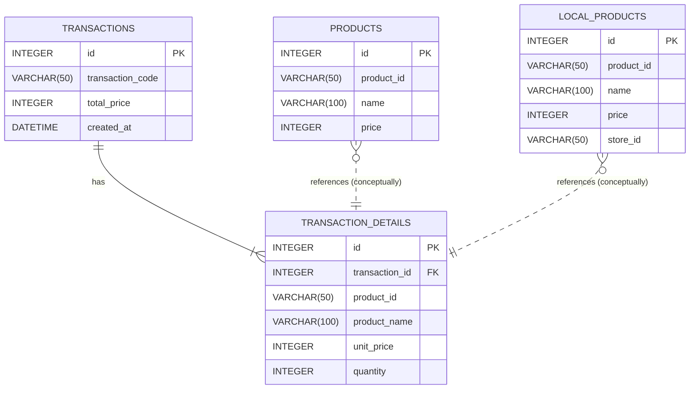

# POSアプリケーション (LV3) データベース設計書

このドキュメントは、アプリケーションが使用するデータベースのスキーマを定義します。
価格はすべて税抜（without tax）で保存します。

---

## 1. ER図 (簡易)

## 2. テーブル定義

### 2.1. `products` (基幹商品マスタ)

- **説明:** 全店舗共通で扱われる商品のマスターデータ。

| カラム名       | 型            | 制約                                  | 説明                   |
| :------------- | :------------ | :------------------------------------ | :--------------------- |
| `id`           | INTEGER       | PK, AutoIncrement                     | サロゲートキー         |
| `product_id` | VARCHAR(50)   | NOT NULL, UNIQUE, Index               | 商品コード (JANコード等) |
| `name`         | VARCHAR(100)  | NOT NULL                              | 商品名                 |
| `price`        | INTEGER       | NOT NULL                              | 単価 (税抜)            |
| `created_at`   | DATETIME      | NOT NULL, Default: NOW()              | 作成日時               |
| `updated_at`   | DATETIME      | NOT NULL, Default: NOW(), ON UPDATE NOW() | 更新日時               |

### 2.2. `local_products` (ローカル拡張マスタ)

| カラム名       | 型            | 制約                                  | 説明                   |
| :------------- | :------------ | :------------------------------------ | :--------------------- |
| `id`           | INTEGER       | PK, AutoIncrement                     | サロゲートキー         |
| `product_id` | VARCHAR(50)   | NOT NULL, UNIQUE, Index               | 独自の商品コード       |
| `name`         | VARCHAR(100)  | NOT NULL                              | 商品名                 |
| `price`        | INTEGER       | NOT NULL                              | 単価 (税抜)            |
| `store_id`     | VARCHAR(50)   | NOT NULL, Index                       | この商品が属する店舗ID |
| `created_at`   | DATETIME      | NOT NULL, Default: NOW()              | 作成日時               |
| `updated_at`   | DATETIME      | NOT NULL, Default: NOW(), ON UPDATE NOW() | 更新日時               |

### 2.3. `transactions` (取引ヘッダ)

- **説明:** 一回の会計（レシート1枚分）の概要情報を保存する。

| カラム名           | 型          | 制約                     | 説明                                         |
| :----------------- | :---------- | :----------------------- | :------------------------------------------- |
| `id`               | INTEGER     | PK, AutoIncrement        | サロゲートキー                               |
| `transaction_code` | VARCHAR(50) | NULL, UNIQUE             | 外部システム連携用のユニークな取引コード     |
| `total_price`      | INTEGER     | NOT NULL                 | この取引の合計金額 (税抜)                    |
| `created_at`       | DATETIME    | NOT NULL, Default: NOW() | 取引日時                                     |

### 2.4. `transaction_details` (取引明細)

- **説明:** 一回の会計に含まれる、各商品の詳細情報を保存する。

| カラム名         | 型            | 制約             | 説明                                    |
| :--------------- | :------------ | :--------------- | :-------------------------------------- |
| `id`             | INTEGER       | PK, AutoIncrement| サロゲートキー                          |
| `transaction_id` | INTEGER       | NOT NULL, FK     | どの取引に属するか (`transactions.id`)  |
| `product_id`   | VARCHAR(50)   | NOT NULL         | 購入された商品のコード                  |
| `product_name`   | VARCHAR(100)  | NOT NULL         | 購入時点の商品名 (冗長化)               |
| `unit_price`     | INTEGER       | NOT NULL         | 購入時点の単価 (税抜, 冗長化)           |
| `quantity`       | INTEGER       | NOT NULL         | 購入数量                                |

---

#### 設計のポイント

- **ER図:** `mermaid`記法でテーブル間の関係性を視覚化しています。VS Codeのプレビューで図として表示できます。
- **正規化と冗長化のバランス:**
  - `transaction_details`には`product_id`だけを持たせるのが正規化の考え方ですが、`product_name`と`unit_price`を**あえて冗長化して保存**しています。
  - **理由:** もし将来、商品マスタの価格が「100円→120円」に改定されても、過去の売上データ（「100円で売れた」という事実）が変わらないようにするためです。これは会計システムにおける重要な設計思想です。
- **サロゲートキー:** 全てのテーブルに`id`というシンプルな主キー（サロゲートキー）を設けることで、リレーションの管理が容易になります。

---
