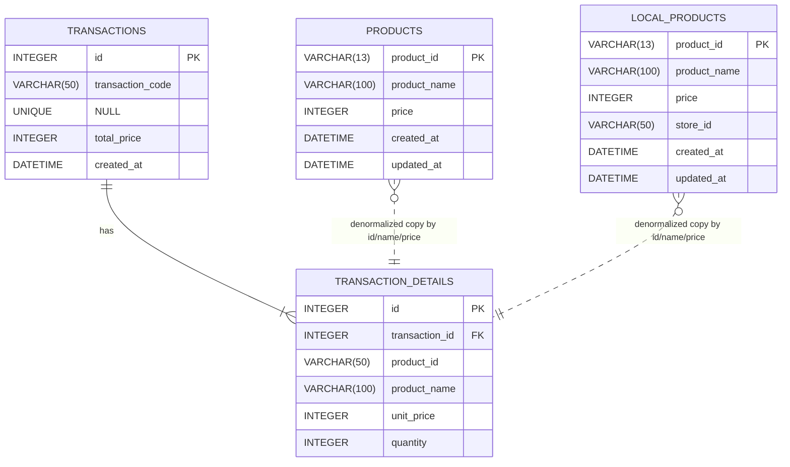

# POSアプリケーション (LV3) データベース設計書

このドキュメントは、アプリケーションが使用するデータベースのスキーマを定義します。
価格はすべて税抜（without tax）で保存します。

---

## 1. ER図 (実装準拠・簡易)

## 2. テーブル定義

### 2.1. `products` (基幹商品マスタ)

- **説明:** 全店舗共通で扱われる商品のマスターデータ。

| カラム名         | 型           | 制約                         | 説明                   |
| :--------------- | :----------- | :--------------------------- | :--------------------- |
| `product_id`     | VARCHAR(13)  | PK, Index                    | 商品コード (JAN 主キー) |
| `product_name`   | VARCHAR(100) | NOT NULL                     | 商品名                 |
| `price`          | INTEGER      | NOT NULL                     | 単価 (税抜)            |
| `created_at`     | DATETIME     | Default: NOW()               | 作成日時               |
| `updated_at`     | DATETIME     | Default: NOW(), ON UPDATE NOW() | 更新日時            |

### 2.2. `local_products` (ローカル拡張マスタ)

| カラム名         | 型           | 制約                 | 説明                   |
| :--------------- | :----------- | :------------------- | :--------------------- |
| `product_id`     | VARCHAR(13)  | PK, Index            | 商品コード (JAN 主キー) |
| `product_name`   | VARCHAR(100) | NOT NULL             | 商品名                 |
| `price`          | INTEGER      | NOT NULL             | 単価 (税抜)            |
| `store_id`       | VARCHAR(50)  | NOT NULL, Index      | 店舗ID（デフォルト `default_store`） |
| `created_at`     | DATETIME     | Default: NOW()       | 作成日時               |
| `updated_at`     | DATETIME     | Default: NOW(), ON UPDATE NOW() | 更新日時        |

### 2.3. `transactions` (取引ヘッダ)

| カラム名           | 型          | 制約                       | 説明                           |
| :----------------- | :---------- | :------------------------- | :----------------------------- |
| `id`               | INTEGER     | PK, AutoIncrement          | サロゲートキー                 |
| `transaction_code` | VARCHAR(50) | NULL, UNIQUE               | 表示用の取引コード             |
| `total_price`      | INTEGER     | NOT NULL                   | 合計金額 (税抜)                |
| `created_at`       | DATETIME    | Default: NOW()             | 取引日時                       |

### 2.4. `transaction_details` (取引明細)

| カラム名         | 型            | 制約                                              | 説明                          |
| :--------------- | :------------ | :------------------------------------------------ | :---------------------------- |
| `id`             | INTEGER       | PK, AutoIncrement                                 | サロゲートキー                |
| `transaction_id` | INTEGER       | NOT NULL, FK (`transactions`.`id`) ON DELETE CASCADE, Index | どの取引に属するか |
| `product_id`     | VARCHAR(50)   | NOT NULL, Index                                   | 購入された商品のコード        |
| `product_name`   | VARCHAR(100)  | NOT NULL                                          | 購入時点の商品名 (冗長化)     |
| `unit_price`     | INTEGER       | NOT NULL                                          | 購入時点の単価 (税抜, 冗長化) |
| `quantity`       | INTEGER       | NOT NULL                                          | 購入数量                      |

（現状スキーマには`stores`テーブルは存在しません。`local_products.store_id`は文字列で保持し、FKは未設定です）

---

#### 設計のポイント

- **ER図:** `mermaid`記法でテーブル間の関係性を視覚化しています。VS Codeのプレビューで図として表示できます。
- **正規化と冗長化のバランス:**
  - `transaction_details`には`product_id`だけを持たせるのが正規化の考え方ですが、`product_name`と`unit_price`を**あえて冗長化して保存**しています。
  - **理由:** もし将来、商品マスタの価格が「100円→120円」に改定されても、過去の売上データ（「100円で売れた」という事実）が変わらないようにするためです。これは会計システムにおける重要な設計思想です。
- **サロゲートキー:** 取引系テーブルは`id`のサロゲートキー、商品マスタはJAN主キーのハイブリッド構成です。

---

#### 追加の設計ポイント

- 整合性:
  - `transaction_details.transaction_id` は親削除時に連鎖削除。
  - 金額/数量に非負チェックを付与。
- パフォーマンス:
  - Index 推奨: `transaction_details(transaction_id)`, `transaction_details(product_id)`, `transactions(created_at)`.
- 一意性:
  - `local_products` は店舗内での商品コード重複を禁止するため UNIQUE (store_id, product_id)。
