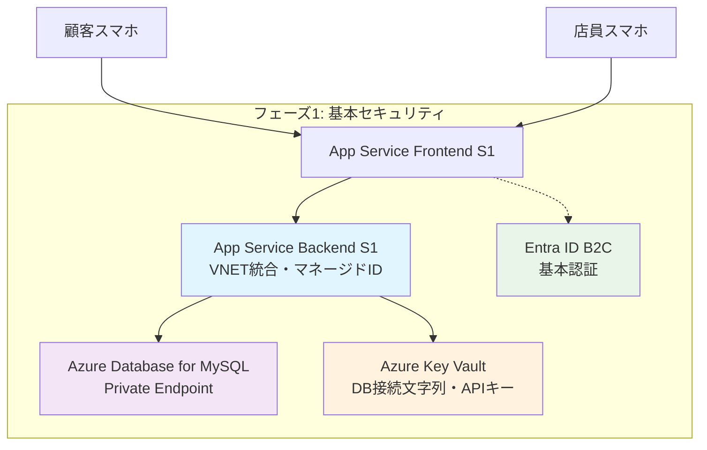
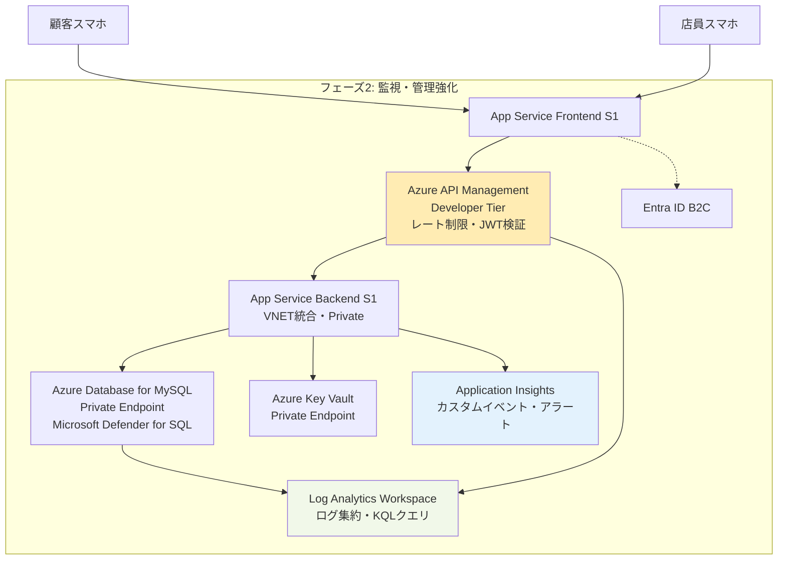
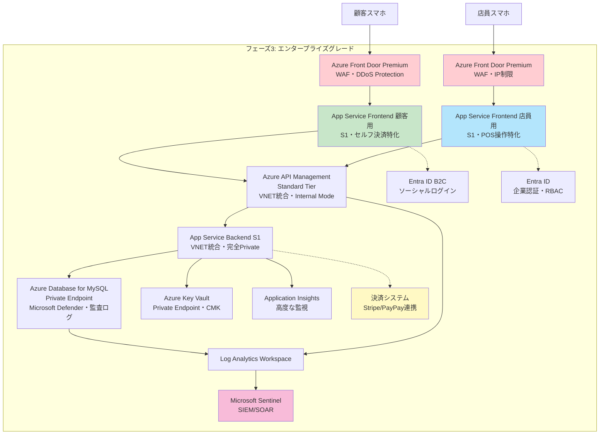

# セキュアなAzureリソース構成案

**作成日**: 2025-10-20

**対象**: LV3 POSアプリケーション

**目的**: セキュリティに振り切ったAzure構成の設計

---

## 現状の構成と課題

### 現在の構成

- **Frontend App Service**: B1、パブリックアクセス
- **Backend App Service**: B1、パブリックアクセス
- **Azure Database for MySQL**: 許可済みIPのみアクセス可能だが、あらゆるAzureリソースからの通信を受け入れている
- **認証**: なし（誰でもAPIアクセス可能）

### 新規要件

- 一度に営業するのは単一店舗
- **買い物客が自分のスマホで決済までできるようにしたい**
- 認証と決済システム連携が必要

### Azureからの推奨事項

- App ServiceはマネージドIDを使用する必要がある
- Azure Database for MySQLにはMicrosoft Defender for SQLを有効にする必要がある

---

## セキュリティに振り切ったAzure構成案

### アーキテクチャ概要

```text
[顧客スマホ] → [Azure Front Door + WAF] → [Frontend App Service (顧客向け)]
                                          ↓
[店員スマホ] → [Azure Front Door + WAF] → [Frontend App Service (店員向け)]
                                          ↓
                          [Azure API Management (VNET統合)]
                                          ↓
                          [Backend App Service (VNET統合・Private)]
                                          ↓
                          [Azure Database for MySQL (Private Endpoint)]
                                          ↓
                          [Azure Key Vault (Private Endpoint)]
```

---

## 主要な変更点と判断理由

### 1. アプリケーション分離が必須

**現状の問題**: 顧客と店員が同じフロントエンドを使う設計では、認証・認可が複雑化

**提案**:

- **顧客向けフロントエンド**: セルフ決済用・公開
- **店員向けフロントエンド**: POS操作用・店舗IPまたはEntra ID認証

**理由**: セキュリティ境界を明確化し、顧客が管理機能にアクセスできないようにする

---

### 2. ネットワーク層の完全分離

#### Backend App Service (S1以上推奨)

- VNET統合を有効化（Standard SKU以上が必要）
- パブリックアクセスを完全にオフ
- アウトバウンドはVNET経由のみ
- マネージドIDを有効化（Key VaultとDB接続用）

#### Azure Database for MySQL

- Private Endpointで接続（パブリックエンドポイント無効化）
- 「あらゆるAzureリソースからの通信を受け入れる」を**無効化**
- SSL/TLS 1.2強制
- Microsoft Defender for SQLを有効化
- 監査ログを有効化してLog Analytics Workspaceへ送信

**理由**: データ層とアプリケーション層を完全にプライベート化することで、攻撃対象領域を最小化

---

### 3. API Management導入（重要）

#### 構成

- Developer/Standard tier（本番ならStandard以上）
- VNET統合（Internal mode）
- Backend App Serviceへのプライベート接続

#### セキュリティ機能

- **レート制限**: 顧客API（決済）は厳しく、店員APIは緩く
- **JWT検証**: 顧客はAuth0/Entra ID B2C、店員はEntra ID
- **IPホワイトリスト**: 管理系API（`/products-with-local`等）は店舗IPのみ
- **リクエストサイズ制限**: `items`配列の上限100件を強制
- **レスポンスキャッシュ**: 商品情報のキャッシュで負荷軽減

**理由**: マイクロサービス的なセキュリティポリシーを一元管理でき、Backend APIを完全に隠蔽できる

---

### 4. 認証・認可の実装

#### 顧客向け（セルフ決済）

- **Azure AD B2C** または **Auth0**での認証
- ソーシャルログイン（Google, LINE等）
- 購入APIには必ず顧客IDを紐付け
- トランザクション詐欺検知のため、同一顧客の購入頻度を監視

#### 店員向け（POS操作）

- **Entra ID（旧Azure AD）** での企業認証
- 条件付きアクセス（特定IPからのみ、MFA必須等）
- ロールベースアクセス制御（RBAC）
  - `Store.Cashier`: 商品スキャン・購入処理のみ
  - `Store.Manager`: 商品管理・レポート閲覧
  - `Store.Admin`: 全機能

#### Backend APIの変更例

```python
# 全エンドポイントで認証必須に
from fastapi import Security
from fastapi.security import HTTPBearer

security = HTTPBearer()

@app.get("/api/v1/products/{product_id}")
async def get_product(
    product_id: str,
    credentials: HTTPAuthorizationCredentials = Security(security),
    db: Session = Depends(get_db)
):
    # JWT検証（API Managementで事前検証済み）
    # store_idをトークンから取得
    # ローカル商品検索時にstore_idでフィルタ
    pass
```

---

### 5. 決済システム連携のセキュリティ

#### Stripe/PayPay等との連携

- 決済APIキーは**Azure Key Vault**に保存
- Backend App ServiceからマネージドIDでアクセス
- PCI DSS準拠のため、カード情報は一切サーバーに送信しない
- 決済トークン化をフロントエンドで実施（Stripe Elements等）
- Webhook検証を必ず実装（署名検証）

#### 新規エンドポイント案

```json
POST /api/v1/payments
{
  "transaction_id": "TRN-20250126-0001",
  "payment_method": "stripe_token_xxxxx",
  "amount": 1265
}
```

**理由**: PCI DSS要件を満たしつつ、決済情報漏洩リスクを最小化

---

### 6. シークレット管理の徹底

#### Azure Key Vault

- Private Endpoint経由でのアクセスのみ
- Backend App ServiceのマネージドIDに以下を許可:
  - DB接続文字列（ユーザー/パスワード）
  - 決済APIキー
  - JWT署名キー
- ソフトデリート有効化（誤削除対策）
- バージョニング管理
- 監査ログをLog Analytics Workspaceへ

#### 環境変数の変更例

```python
# database.pyの変更案
import os
from azure.identity import DefaultAzureCredential
from azure.keyvault.secrets import SecretClient

if DB_TYPE == "mysql":
    credential = DefaultAzureCredential()
    key_vault_url = os.getenv("KEY_VAULT_URL")
    client = SecretClient(vault_url=key_vault_url, credential=credential)

    DB_USER = client.get_secret("db-username").value
    DB_PASSWORD = client.get_secret("db-password").value
```

---

### 7. 監視・ログ・アラート

#### Application Insights

- すべてのApp ServiceとAPI Managementで有効化
- カスタムイベント:
  - 認証失敗（5分で10回→アラート）
  - 異常な高額取引（1万円以上）
  - 同一IPから短時間の大量リクエスト
  - 存在しない商品IDへの連続アクセス

#### Log Analytics Workspace

- すべてのAzureリソースのログを集約
- KQL（Kusto Query Language）でクエリ
- 自動アラート設定:
  - 深夜のAPI呼び出し（営業時間外）
  - データベース接続失敗の増加
  - 異常なトラフィックパターン

#### Microsoft Sentinel（オプション）

- SIEM/SOARとして高度な脅威検知
- コストが高いため、予算次第

---

### 8. WAF（Web Application Firewall）

#### Azure Front Door Premium

- OWASP Top 10対策のマネージドルール
- カスタムルール:
  - SQLインジェクションパターンの検知
  - XSS攻撃の検知
  - ボット対策（Challenge-Response）
  - Geoブロック（日本以外からのアクセス制限）
- DDoS Protection Standard有効化

**理由**: アプリケーション層の攻撃を最前線でブロック

---

### 9. CI/CDのセキュリティ強化

#### GitHub Actions

- OIDC認証でAzureに接続（Publish Profileを廃止）
- シークレットスキャン（Trufflehog等）
- 依存関係の脆弱性スキャン（Dependabot, Snyk）
- コンテナイメージスキャン（Trivy）
- IaCでのデプロイ（Bicep or Terraform）

#### ワークフロー改善例

```yaml
# .github/workflows/deploy-backend.ymlの改善案
- name: Azure Login with OIDC
  uses: azure/login@v1
  with:
    client-id: ${{ secrets.AZURE_CLIENT_ID }}
    tenant-id: ${{ secrets.AZURE_TENANT_ID }}
    subscription-id: ${{ secrets.AZURE_SUBSCRIPTION_ID }}
```

---

### 10. データ保護の追加施策

#### Azure Database for MySQL

- 自動バックアップ保持期間を35日に設定
- geo冗長バックアップ有効化（災害対策）
- ポイントインタイムリストア設定
- 保存時暗号化（TDE）は自動有効
- カスタマーマネージドキー（CMK）の検討（Key Vault連携）

#### 個人情報対応

- 顧客の購入履歴にユーザーIDを追加
- GDPR/個人情報保護法対応のため、削除リクエストAPIを実装
- 保持期間ポリシーの設定（例: 2年後自動削除）

---

## 段階的導入の推奨順序

予算制約がある場合、以下の優先順位で導入を検討してください。

### フェーズ1（必須・¥40,000/月程度）



1. App ServiceのSKUをS1にアップグレード（VNET統合のため）
2. マネージドID有効化
3. Database Private Endpoint導入
4. 基本的な認証機能（Entra ID B2C）
5. Key Vault導入

### フェーズ2（推奨・¥70,000/月程度）



1. API Management導入
2. Application Insights/Log Analytics
3. Microsoft Defender for SQL
4. アラート設定

### フェーズ3（理想・¥110,000/月）



---

## コスト試算（月額概算・東日本リージョン）

| リソース | SKU/構成 | 概算月額 |
|---------|---------|---------|
| App Service (Frontend顧客) | S1 | ¥10,000 |
| App Service (Frontend店員) | B2 | ¥8,000 |
| App Service (Backend) | S1 | ¥10,000 |
| Azure Database for MySQL | GP_Gen5_2 | ¥20,000 |
| - Private Endpoint | x1 | ¥1,000 |
| - Microsoft Defender for SQL | - | ¥15,000 |
| API Management | Developer | ¥5,000 |
| Azure Front Door Premium | - | ¥35,000 |
| Azure Key Vault | Standard | ¥500 |
| Application Insights | 5GB/月 | ¥1,500 |
| Log Analytics Workspace | 5GB/月 | ¥1,500 |
| VNet, NSG等 | - | ¥500 |
| **合計** | | **約¥108,000/月** |

**現在の構成（B1 x2 + DB）が約¥15,000/月と仮定すると、約7倍のコスト増になります。**

---

## まとめ

このセキュア構成により以下を達成できます：

1. **ゼロトラスト原則**: すべての通信が認証・暗号化済み
2. **攻撃対象領域の最小化**: Backend/DBが完全プライベート
3. **監査可能性**: すべてのアクセスがログ記録済み
4. **法令遵守**: PCI DSS、個人情報保護法対応
5. **運用の自動化**: Infrastructure as Code、CI/CDパイプライン

ただし、現在の7倍のコストがかかるため、フェーズ分けでの段階的導入を強く推奨します。
