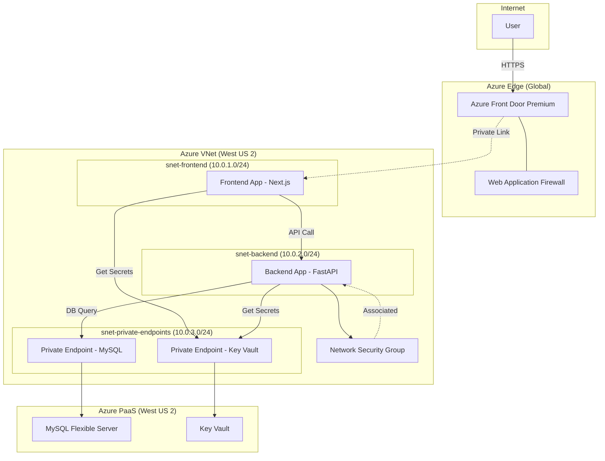

# Azure resource architecture

## step4 POSアプリのアーキテクチャ図

```mermaid
graph TD
    subgraph Internet
        User[User]
    end

    subgraph "Azure Edge (Global)"
        FD[Azure Front Door Premium]
        WAF[Web Application Firewall]
        FD --- WAF
    end

    subgraph "Azure VNet (West US 2)"
        subgraph "snet-frontend (10.0.1.0/24)"
            Frontend[Frontend App - Next.js]
        end

        subgraph "snet-backend (10.0.2.0/24)"
            Backend[Backend App - FastAPI]
        end

        subgraph "snet-private-endpoints (10.0.3.0/24)"
            PE_MySQL[Private Endpoint - MySQL]
            PE_KV[Private Endpoint - Key Vault]
        end

        NSG[Network Security Group]
        Backend --> NSG
        NSG -.->|Associated| Backend
    end

    subgraph "Azure PaaS (West US 2)"
        MySQL[MySQL Flexible Server]
        KeyVault[Key Vault]
    end

    %% Data Flow
    User -->|HTTPS| FD
    FD -.->|Private Link| Frontend
    Frontend -->|API Call| Backend
    Backend -->|DB Query| PE_MySQL
    PE_MySQL --> MySQL
    Frontend -->|Get Secrets| PE_KV
    Backend -->|Get Secrets| PE_KV
    PE_KV --> KeyVault
```
